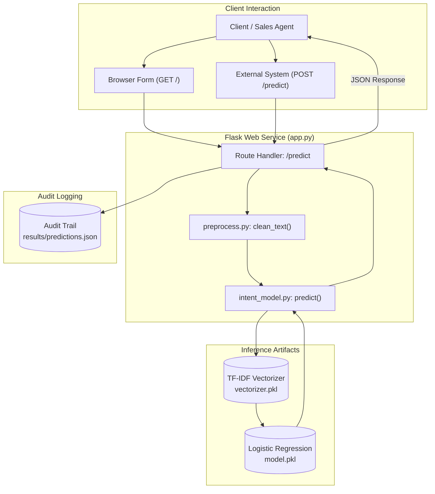

# Mini Intent Classifier (Lead Qualification Microservice)

> A lightweight, explainable NLP microservice and Flask API for triaging inbound customer inquiries into High, Medium, or Low purchase intent using TF-IDF and Logistic Regression.

[](https://www.python.org/)
[](https://flask.palletsprojects.com/)
[](https://scikit-learn.org/)
[](https://joblib.readthedocs.io/)

[Repository](https://github.com/Rohitk69992/Mini-Intent-Classifier) • [Architecture](#system-architecture) • [NLP Pipeline](#nlp-pipeline--modeling) • [API Specification](#api-specification) • [Quickstart](#installation--execution)

---

## Overview

In sales enablement, CRM operations, and marketing automation platforms (such as Leadequator), inbound leads arrive through varied channels (e.g. social media comments, inquiry forms, chat widgets). Manually reviewing every message to identify high-intent prospects creates lead response latency and misallocates sales representative bandwidth.

The **Mini Intent Classifier** provides an end-to-end, interpretable text classification service that scores commercial interest into three actionable tiers:
- **`high`**: Direct commercial inquiries (e.g., pricing requests, demo sign-ups, purchasing interest).
- **`medium`**: Informational inquiries, product comparisons, or exploratory questions.
- **`low`**: Non-commercial messages, casual social remarks, or general feedback.

---

## Key Features

- **Multi-Tier Intent Scoring:** Evaluates natural-language queries into discrete commercial intent categories (`high`, `medium`, `low`).
- **Explainable Classical ML Architecture:** Employs TF-IDF term weighting paired with Multinomial Logistic Regression for sub-millisecond inference and transparent decision boundaries.
- **Dual Interface Design:** Provides both a browser-based testing interface and a structured RESTful JSON endpoint (`POST /predict`).
- **Structured Prediction Logging:** Transparently logs requests, normalized text, predicted labels, confidence scores, and timestamps to `results/predictions.json`.
- **Lightweight Footprint:** Requires minimal memory (<50 MB resident memory) with zero heavyweight GPU dependencies.

---

## System Architecture



---

## NLP Pipeline & Modeling

```
Raw Query
   │
   ▼
[ 1. Preprocessing ] ─────► Lowercasing, URL removal, non-alpha removal, whitespace stripping
   │
   ▼
[ 2. Vectorization ] ─────► TF-IDF feature extraction via vectorizer.pkl
   │
   ▼
[ 3. Classification ] ────► Logistic Regression via model.pkl
   │
   ▼
[ 4. Probability Output ] ─► Argmax class selection + Softmax confidence float
   │
   ▼
Return: (cleaned_query, predicted_intent, confidence_score)
```

### 1. Text Preprocessing (`preprocess.py`)
Normalization strips syntactic noise to ensure clean vocabulary matching:
```python
def clean_text(text: str) -> str:
    text = text.lower()
    text = re.sub(r"http\S+", "", text)       # Strip URLs
    text = re.sub(r"[^a-z\s]", "", text)      # Retain alphabetic tokens
    text = re.sub(r"\s+", " ", text).strip()  # Normalize whitespace
    return text
```

### 2. Model Rationale (from `NOTES.txt`)
- **Why Logistic Regression?** Linear models provide fast, highly interpretable coefficient weights on short text inputs. Unlike recurrent networks or transformers, logistic regression trains in seconds, runs instantaneously on CPU, and avoids parameter overfitting on compact datasets.
- **Confidence Semantics:** Confidence values reflect normalized probability of the selected class, indicating the model's certainty in its assignment.

---

## API Specification

### Endpoint: `POST /predict`
Processes a raw text query and returns structured classification results.

#### Request Headers
```http
Content-Type: application/json
```

#### Request Body
```json
{
  "text": "Can I get a demo of your CRM platform?"
}
```

#### Response Body (`200 OK`)
```json
{
  "original_text": "Can I get a demo of your CRM platform?",
  "cleaned_text": "can i get a demo of your crm platform",
  "intent": "high",
  "confidence": 0.8924,
  "timestamp": "2026-10-07 16:45:00"
}
```

---

## Project Structure

```bash
Mini-Intent-Classifier/
├── app.py              # Flask server hosting web interface and /predict endpoint
├── intent_model.py     # Inference module loading model artifacts and generating predictions
├── preprocess.py       # Regex text cleaning and normalization functions
├── train_model.py      # Training script fitting TF-IDF and Logistic Regression on train.csv
├── train.csv           # Seed dataset of labeled sales and lead queries (high, medium, low)
├── requirements.txt    # Python package dependencies
├── NOTES.txt           # Architectural notes on model selection, data trade-offs, and design decisions
└── README.md
```

---

## Installation & Execution

### Prerequisites
- Python 3.9 or higher
- Git

### 1. Clone the Repository
```bash
git clone https://github.com/Rohitk69992/Mini-Intent-Classifier.git
cd Mini-Intent-Classifier
```

### 2. Create and Activate Virtual Environment
```bash
# Windows (PowerShell)
python -m venv .venv
.venv\Scripts\Activate.ps1

# Linux / macOS
python3 -m venv .venv
source .venv/bin/activate
```

### 3. Install Dependencies
```bash
pip install flask scikit-learn pandas joblib
```

### 4. (Optional) Retrain the Model
To re-fit the vectorizer and classifier from `train.csv`:
```bash
python train_model.py
```

### 5. Launch the Web & API Service
```bash
python app.py
```
The server will start at `http://127.0.0.1:5000`.

---

## Technical Stack

| Layer | Technology | Purpose |
| :--- | :--- | :--- |
| **Language** | Python 3.10+ | Core programming runtime |
| **Web Framework** | Flask | HTTP routing, JSON API, and template rendering |
| **Machine Learning** | Scikit-Learn | TF-IDF feature extraction, Logistic Regression modeling |
| **Model Persistence** | Joblib | Model and vectorizer binary serialization |
| **Text Processing** | Regular Expressions (`re`) | Rule-based lexical normalization |

---

## Limitations & Future Scope

- **Dataset Scale:** The seed dataset `train.csv` is designed as a focused proof-of-concept; augmenting training samples with diverse domain queries will improve out-of-domain robustness.
- **Vocabulary Coverage:** Out-of-vocabulary terms in unseen queries do not contribute to TF-IDF representations; subword tokenization or word embedding averages could capture semantic synonyms.
- **Database Integration:** Predictions are currently appended to local JSON; a production service would pipe logs to PostgreSQL or an enterprise message queue (Kafka/RabbitMQ).

---

## Author

**Rohit K.**  
*AI & Data Science Student*  
GitHub: [@Rohitk69992](https://github.com/Rohitk69992)
